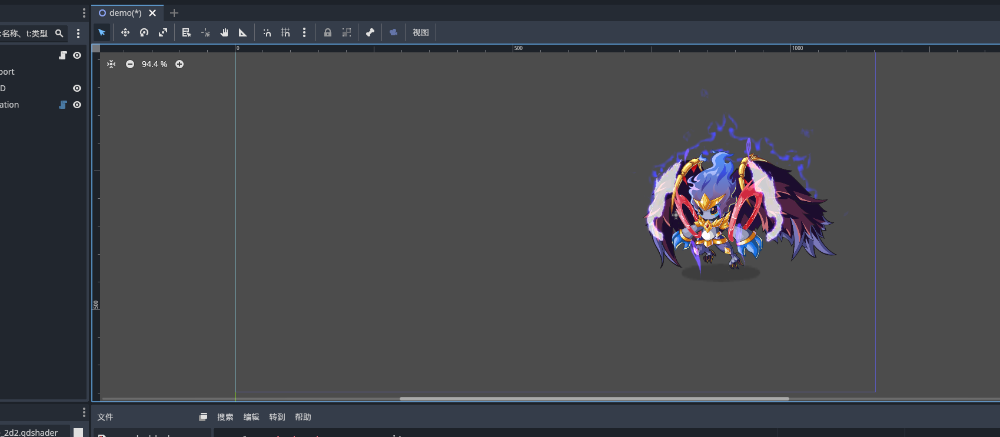

# Godot Flash Animation

The plugin can bring Flash animations into Godot.

## Feature

- [x] Support for importing Flash animations and Blend Render.
- [x] Multi Animation.  (Require follow certain rules, refer to the conversion tool.)
- [ ] Filter Render.

## Demo

## Usage

  1. Download the Flash conversion tool from the following link:  
   [Swf Tool](https://github.com/aojiaoxiaolinlin/swf_animation)

  2. Use a packing tool that can save file names. I have only tested with **Texture Packer**.

  3. After importing both this plugin and the packing tool plugin, enable the plugins. Then, create a new **SwfAnimation** node, and attach the generated `*.json` animation file resource to the node's **Animation Data** property.

## License

This code is licensed under dual MIT / Apache-2.0 but with no attribution necessary. All contributions must agree to this licensing.
